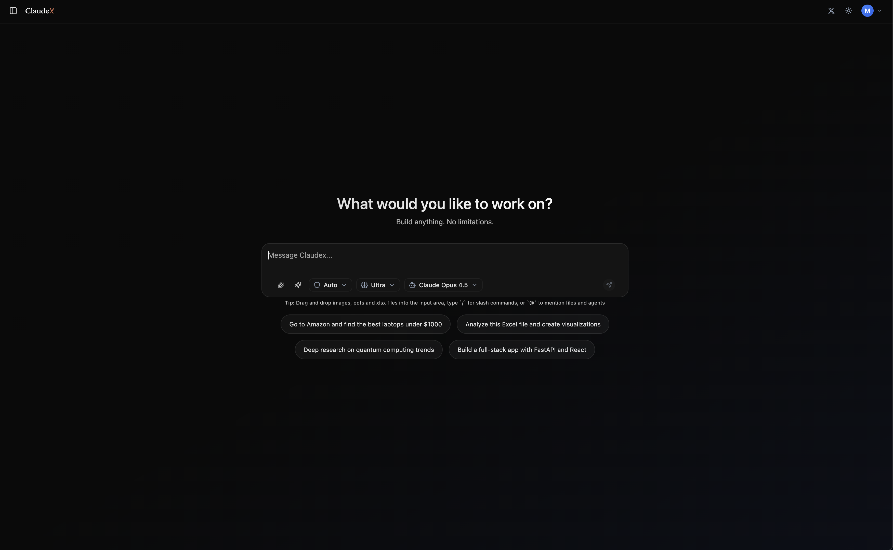
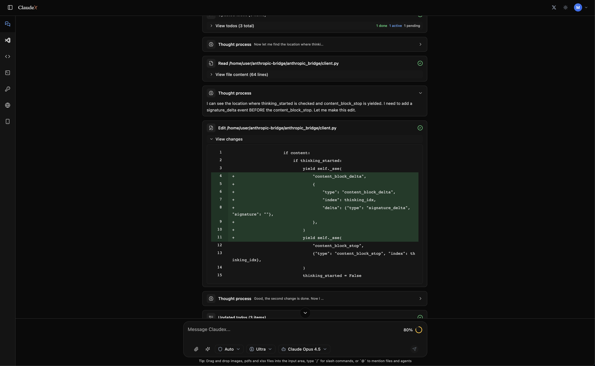

# Claudex

Self-hosted Claude Code workspace with multi-provider routing, sandboxed execution, and a full web IDE.

[](https://www.apache.org/licenses/LICENSE-2.0)
[](https://www.python.org/)
[](https://reactjs.org/)
[](https://fastapi.tiangolo.com/)
[](https://discord.gg/cp3sBgEX)

## Community

Join the [Discord server](https://discord.gg/cp3sBgEX).

## Why Claudex

- Claude Code as the execution harness, exposed through a self-hosted web UI
- One workflow across Anthropic, OpenAI, GitHub Copilot, OpenRouter, GLM (Zhipu AI), A4F, and custom Anthropic-compatible endpoints
- Anthropic Bridge routing for non-Anthropic providers while preserving Claude Code behavior
- Isolated sandbox backends (Docker, host)
- Extension surface: MCP servers, skills, agents, slash commands, prompts, and marketplace plugins
- Provider switching with shared working context

## Core Architecture

```text
React/Vite Frontend
  -> FastAPI Backend
  -> PostgreSQL + Redis (web/docker mode)
  -> SQLite + in-memory cache/pubsub (desktop mode)
  -> Sandbox runtime (Docker/Host)
  -> Claude Code CLI + claude-agent-sdk
```

### Claude Code harness

Claudex runs chats through `claude-agent-sdk`, which drives the Claude Code CLI in the selected sandbox. This keeps Claude Code-native behavior for tools, session flow, permission modes, and MCP orchestration.

### Anthropic Bridge for non-Anthropic providers

For OpenAI, OpenRouter, and Copilot providers, Claudex starts `anthropic-bridge` inside the sandbox and routes Claude Code requests through:

- `ANTHROPIC_BASE_URL=http://127.0.0.1:3456`
- provider-specific auth secrets such as `OPENROUTER_API_KEY` and `GITHUB_COPILOT_TOKEN`
- provider-scoped model IDs like `openai/gpt-5.2-codex`, `openrouter/moonshotai/kimi-k2.5`, `copilot/gpt-5.2-codex`

```text
Claudex UI
  -> Claude Agent SDK + Claude Code CLI
  -> Anthropic-compatible request shape
  -> Anthropic Bridge (OpenAI/OpenRouter/Copilot)
  -> Target provider model
```

For Anthropic providers, Claudex uses your Claude auth token directly. For custom providers, Claudex calls your configured Anthropic-compatible `base_url`.

## Key Features

- Claude Code-native chat execution through `claude-agent-sdk`
- Anthropic Bridge provider routing with provider-scoped models (`openai/*`, `openrouter/*`, `copilot/*`)
- Multi-sandbox runtime (Docker/Host)
- MCP + custom skills/agents/commands + plugin marketplace
- Checkpoint restore and chat forking from any prior message state
- Streaming architecture with resumable SSE events and explicit cancellation
- Built-in recurring task scheduler (in-process async, no worker service)

## Quick Start (Web)

### Requirements

- Docker + Docker Compose

### Start

```bash
git clone https://github.com/Mng-dev-ai/claudex.git
cd claudex
docker compose -p claudex-web -f docker-compose.yml up -d
```

Open [http://localhost:3000](http://localhost:3000).

### Stop and logs

```bash
docker compose -p claudex-web -f docker-compose.yml down
docker compose -p claudex-web -f docker-compose.yml logs -f
```

## Desktop (macOS)

Desktop mode uses Tauri with a bundled Python backend sidecar on `localhost:8081`, with local SQLite storage.

### Download prebuilt app

- Apple Silicon DMG: [Latest Release](https://github.com/Mng-dev-ai/claudex/releases/latest)

### How it works

When running in desktop mode:

- Tauri hosts the frontend in a native macOS window
- the sidecar backend process serves the API on `8081`
- desktop uses local SQLite plus in-memory cache/pubsub (no Postgres/Redis dependency required for desktop mode)

```text
Tauri Desktop App
  -> React frontend (.env.desktop)
  -> bundled backend sidecar (localhost:8081)
  -> local SQLite database
```

### Build and run from source

Requirements:

- Node.js
- Rust

Dev workflow:

```bash
cd frontend
npm install
npm run desktop:dev
```

Build (unsigned dev):

```bash
cd frontend
npm run desktop:build
```

App bundle output:

- `frontend/src-tauri/target/release/bundle/macos/Claudex.app`

Desktop troubleshooting:

- Backend unavailable: wait for sidecar startup to finish
- Database errors: verify local app data directory permissions
- Port conflict: free port `8081` if already in use

## Provider Setup

Configure providers in `Settings -> Providers`.

- `anthropic`: paste token from `claude setup-token`
- `openai`: authenticate with OpenAI device flow in UI
- `copilot`: authenticate with GitHub device flow in UI
- `openrouter`: add OpenRouter API key and model IDs
- `glm`: add Zhipu AI (GLM) API key and base URL for Anthropic-compatible endpoint
- `a4f`: add A4F API key for multi-provider model access
- `custom`: set Anthropic-compatible `base_url`, token, and model IDs

### GLM Provider (Zhipu AI)

Claudex supports Zhipu AI's GLM models through their Anthropic-compatible API endpoint. GLM models work similarly to custom providers - they use direct API access without the anthropic-bridge proxy.

**Configuration:**
1. Go to `Settings -> Providers`
2. Add a new GLM provider or edit existing one
3. Set the base URL to: `https://open.bigmodel.cn/api/anthropic`
4. Add your GLM API key
5. Configure the models you want to use

**Available Models:**
- `glm-5` - Latest GLM 5 model
- `glm-4.7` - GLM 4.7 model
- `glm-4.6v` - GLM 4.6 Vision model (multimodal)

**How it works:**
GLM provider uses the Anthropic-compatible endpoint directly, setting:
- `ANTHROPIC_BASE_URL` to the GLM API endpoint
- `ANTHROPIC_AUTH_TOKEN` to your GLM API key

This allows Claude Code to communicate with GLM models while maintaining the same request/response format as Anthropic's API.

### A4F Provider

A4F is a multi-provider API aggregation service that provides access to models from various AI providers through a single API.

**Configuration:**
1. Go to `Settings -> Providers`
2. Add a new A4F provider
3. Add your A4F API key
4. Models are automatically fetched from the A4F catalog

**How it works:**
A4F provider connects to `https://api.a4f.co/v1` and aggregates models from multiple providers. Models are displayed without provider prefixes (e.g., `gpt-4o` instead of `openai/gpt-4o`).

## Operation Modes

Claudex supports three operation modes configurable in `Settings -> General`:

- **Individual** (default): Standard single-user mode
- **Client**: Client-facing deployment mode
- **Enterprise**: Enterprise deployment with additional features (RBAC, organization management, etc.)

Operation mode can only be changed by superuser accounts.

### Model examples

- OpenAI/Codex: `gpt-5.2-codex`, `gpt-5.2`, `gpt-5.3-codex`
- OpenRouter catalog examples: `moonshotai/kimi-k2.5`, `minimax/minimax-m2.1`, `google/gemini-3-pro-preview`
- Custom gateways: models like `GLM-5`, `M2.5`, or private org-specific endpoints (depends on your backend compatibility)

## Shared Working Context

Switching providers does not require a new workflow:

- Same sandbox filesystem/workdir
- Same `.claude` resources (skills, agents, commands)
- Same MCP configuration in Claudex
- Same chat-level execution flow

This is the main value of using Claude Code as the harness while changing inference providers behind Anthropic Bridge.

## Services and Ports (Web)

- Frontend: `3000`
- Backend API: `8080`
- PostgreSQL: `5432`
- Redis: `6379`
- VNC: `5900`
- VNC Web: `6080`
- OpenVSCode server: `8765`

## API and Admin

- API docs: [http://localhost:8080/api/v1/docs](http://localhost:8080/api/v1/docs)
- Admin panel: [http://localhost:8080/admin](http://localhost:8080/admin)

## Health and Ops

- Liveness endpoint: `GET /health`
- Readiness endpoint: `GET /api/v1/readyz`
  - web mode checks database + Redis
  - desktop mode checks database (SQLite) only

## Deployment

- VPS/Coolify guide: [docs/coolify-installation-guide.md](docs/coolify-installation-guide.md)
- Production setup uses frontend at `/` and API under `/api/*`

## Screenshots




## Tech Stack

- Frontend: React 19, TypeScript, Vite, TailwindCSS, Zustand, React Query
- Backend: FastAPI, SQLAlchemy, Redis, PostgreSQL/SQLite, Granian
- Runtime: Claude Code CLI, claude-agent-sdk, anthropic-bridge

## License

Apache 2.0. See [LICENSE](LICENSE).

## Contributing

Contributions are welcome. Please open an issue first to discuss what you would like to change, then submit a pull request.

## References

- Anthropic Claude Code SDK: [docs.anthropic.com/s/claude-code-sdk](https://docs.anthropic.com/s/claude-code-sdk)
- Anthropic Bridge package: [pypi.org/project/anthropic-bridge](https://pypi.org/project/anthropic-bridge/)
- OpenAI Codex CLI sign-in: [help.openai.com/en/articles/11381614](https://help.openai.com/en/articles/11381614)
- OpenRouter API keys: [openrouter.ai/docs/api-keys](https://openrouter.ai/docs/api-keys)
- GitHub Copilot plans: [github.com/features/copilot/plans](https://github.com/features/copilot/plans)
